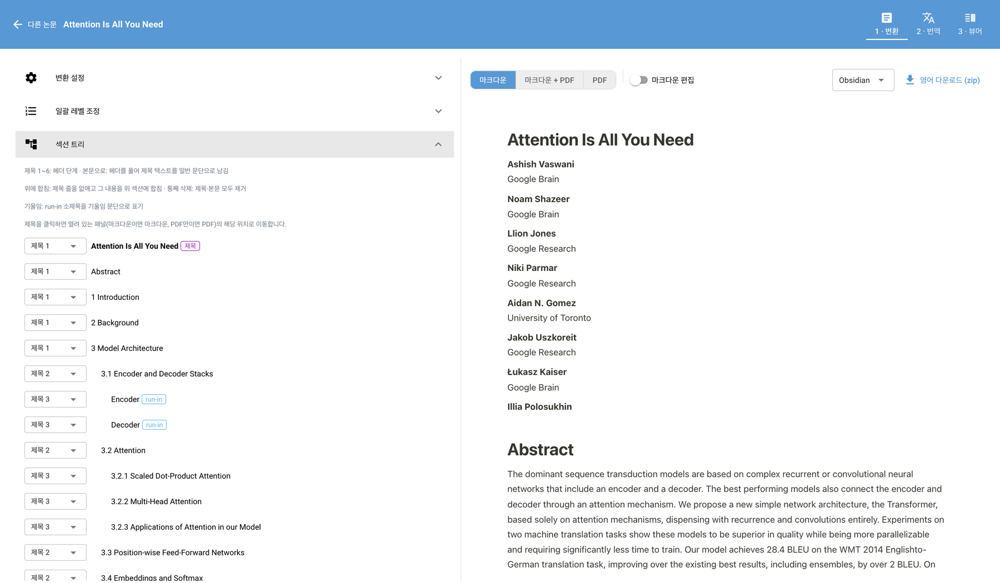
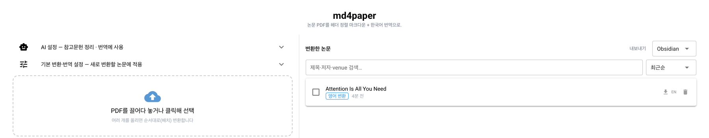
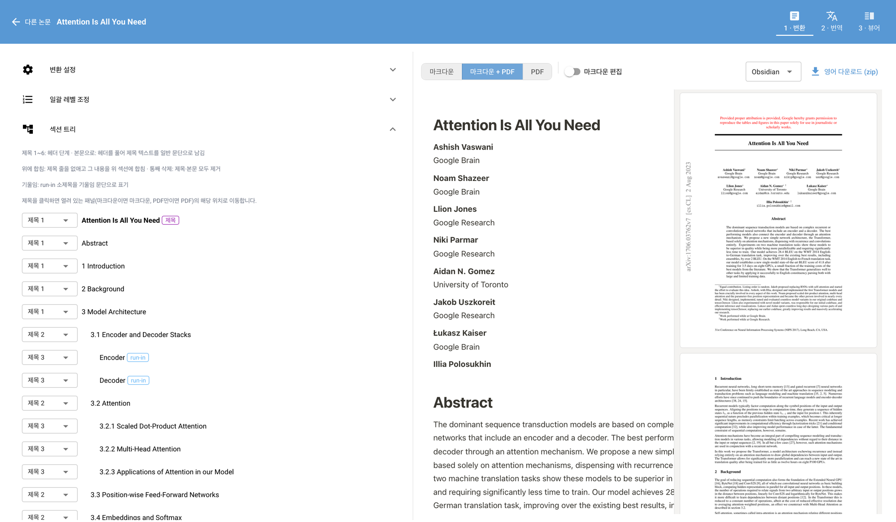
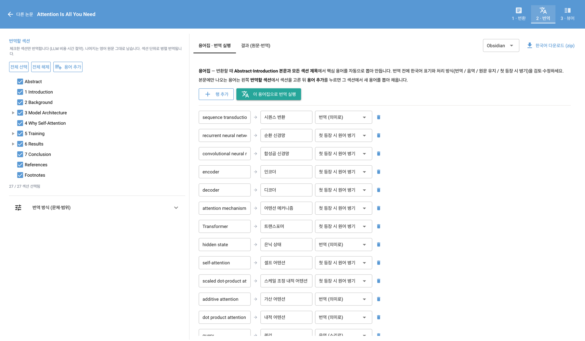
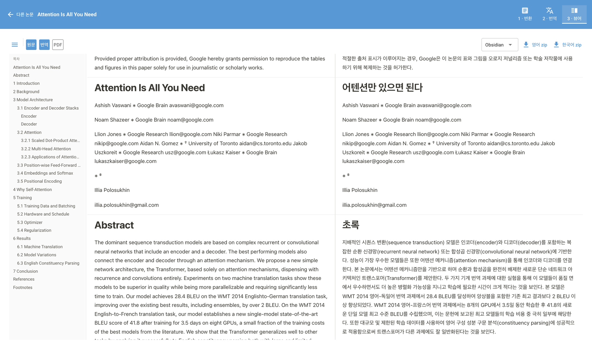

# md4paper

논문 PDF를 **(1) 헤더 구조가 제대로 정렬된 마크다운**과 **(2) 한국어 번역 마크다운**으로 바꿔주는
로컬 도구입니다. 브라우저에서 쓰는 웹 UI가 기본이고(서버는 내 컴퓨터에서만 돕니다), 자동화를 위한
CLI도 함께 들어 있습니다.



- PDF → 마크다운 추출은 [Docling](https://github.com/docling-project/docling)(MIT)으로 **내 컴퓨터에서** 수행합니다.
- 섹션 트리에서 헤더 레벨을 직접 교정하고, PDF 원본과 나란히 대조하며 확인합니다.
- 참고문헌 파싱·인용 링크·용어집·한국어 번역은 **LLM API**를 사용합니다(선택 기능, 키 필요).

## 무엇이 다른가 — 사람이 끼어들 수 있습니다

PDF를 통째로 LLM에 던지고 "번역해줘" 하는 방식과의 차이는, **자동 결과를 사람이 고칠 자리가
파이프라인 중간중간에 열려 있다**는 점입니다.

- **섹션 구조를 직접 고칩니다.** 자동 감지된 헤더 레벨이 틀리면 트리에서 바꾸고, 같은 번호 체계의
  헤더는 한 번에 조정합니다. 필요 없는 섹션은 빼고, 놓친 헤더는 넣습니다. 프리뷰에 즉시 반영됩니다.
- **고친 판단을 기억합니다.** "Acknowledgments는 h2" 같은 교정은 헤더 이름별로 저장돼, 같은 학회
  포맷의 다음 논문에 자동으로 적용됩니다.
- **용어집을 먼저 확정하고 번역합니다.** LLM이 뽑은 용어 후보를 표에서 고친 뒤 그 용어집으로
  번역하므로, 문서 전체에서 번역어가 흔들리지 않습니다.
- **번역 방식을 고릅니다.** 문체(해라체/합니다체/해요체), 헤더를 영어로 둘지, 어느 섹션까지
  번역할지를 섹션 단위로 선택합니다.
- **원본과 대조하며 검수합니다.** 섹션 제목을 누르면 그 PDF 페이지로 이동하고, EN | KO 나란히 보기로
  번역을 확인하고, 마크다운을 직접 손볼 수 있습니다.
- **정해진 규칙은 LLM에 맡기지 않습니다.** 번호 기반 헤더 재정렬, 그림·표 캡션 짝짓기, 이미지 이름
  정리, 수식·코드·링크 보호는 코드가 결정론적으로 처리합니다. LLM은 번역·용어집·참고문헌 파싱에만
  씁니다 — 그래서 결과가 재현되고 비용도 예측 가능합니다.

---

## ⚠️ 먼저 읽어주세요 — 이 프로젝트는 "바이브 코딩"으로 만들었습니다

이 저장소의 코드는 **대부분 LLM(Claude Code)이 작성**했고, 사람이 한 줄씩 검토하지 않았습니다.
개인 연구용으로 만든 도구를 그대로 공개한 것이며, 다음을 이해하고 사용해 주세요.

- **AS-IS, 무보증.** 언제든 깨질 수 있고, 조용히 틀린 결과를 낼 수 있습니다. 프로덕션·업무 크리티컬한
  파이프라인에 넣지 마세요.
- **추출이 내용을 빠뜨릴 수 있습니다.** 표·수식·2단 조판·각주는 특히 취약합니다. 결과물을 반드시
  **원본 PDF와 대조**하세요(웹 UI에 나란히 보기 기능이 있습니다).
- **번역은 LLM이 합니다 — 오역·누락·환각이 있을 수 있습니다.** 숫자, 수식, 실험 결과, 인용 번호가
  바뀌어도 도구는 눈치채지 못할 수 있습니다. 인용하거나 배포할 글에 쓰기 전에 사람이 확인해야 합니다.
- **내 논문 본문이 외부 LLM API로 전송됩니다.** 번역·용어집·참고문헌 파싱을 실행하면 해당 텍스트가
  OpenAI/Anthropic/Google 서버로 갑니다. **미공개 원고, 대외비 문서, 저작권이 걸린 자료**에는
  사용하지 마세요. 추출(PDF→마크다운)만 쓰면 네트워크로 나가는 텍스트는 없습니다.
- **API 요금이 실제로 청구됩니다.** 논문 한 편에 보통 $0.15~0.7 수준이며(→ [비용](#비용--논문-한-편에-얼마나-드나)),
  비용은 전적으로 사용자 부담입니다. 추출만 쓰면 요금은 들지 않습니다.
- **API 키는 평문으로 저장됩니다** (`~/.config/md4paper/config.toml`, POSIX에서는 권한 0600).
  공용 컴퓨터에서는 파일 저장 대신 환경 변수를 쓰세요.
- **버그 리포트는 환영하지만, 지원을 약속하지 않습니다.** 이슈/PR은 여유 있을 때만 봅니다.

---

## 요구 사항

| 항목 | 내용 |
|---|---|
| OS | Windows 10/11, macOS(Apple Silicon·Intel), Linux |
| Python | 3.11 이상 — **직접 설치 안 해도 됩니다**(uv가 알아서 받아옵니다) |
| 디스크 | 의존성 약 **1.3GB**(macOS 실측) + 첫 변환 시 Docling 모델 약 **1.1GB** 다운로드 (Linux는 CUDA용 torch 때문에 더 커질 수 있음) |
| 메모리 | 4GB 이상 권장 (GPU 필수 아님, CPU로 동작) |
| 네트워크 | 설치·첫 모델 다운로드에 필요. 이후 추출은 오프라인 가능 |
| LLM 키 | 번역/인용/용어집에만 필요(선택). OpenAI · Anthropic · Google Gemini 중 하나 |

---

## 설치

패키지 관리자 [uv](https://docs.astral.sh/uv/)만 설치하면 Python까지 uv가 처리합니다.

### 1단계 — uv 설치

**Windows** (PowerShell):
```powershell
powershell -ExecutionPolicy ByPass -c "irm https://astral.sh/uv/install.ps1 | iex"
```
설치 후 **PowerShell 창을 닫고 새로 열어야** `uv` 명령이 잡힙니다.

**macOS / Linux**:
```bash
curl -LsSf https://astral.sh/uv/install.sh | sh
```
(macOS는 Homebrew도 됩니다: `brew install uv`)

확인: `uv --version`

### 2단계 — md4paper 설치하고 웹 UI 켜기

#### 방법 A: 클론해서 쓰기 (권장)

**Windows** (PowerShell):
```powershell
git clone https://github.com/wooogler/md4paper.git
cd md4paper
uv sync --extra ui
uv run md4paper ui
```

**macOS / Linux**:
```bash
git clone https://github.com/wooogler/md4paper.git
cd md4paper
uv sync --extra ui
uv run md4paper ui
```

`--extra ui`가 웹 UI(NiceGUI)를 포함합니다. 의존성 내려받는 데 처음 몇 분 걸립니다.
설치가 잘 됐는지 보려면 `uv run md4paper doctor`.

#### 방법 B: 클론 없이 바로 실행

**Windows** (PowerShell):
```powershell
uvx --from "md4paper[ui] @ git+https://github.com/wooogler/md4paper" md4paper ui
```

**macOS / Linux**:
```bash
uvx --from 'md4paper[ui] @ git+https://github.com/wooogler/md4paper' md4paper ui
```

첫 실행은 의존성을 받으므로 몇 분 걸립니다. 이 방식에서 작업 폴더 기본값은 `~/md4paper/output`
(Windows는 `C:\Users\<사용자>\md4paper\output`)입니다.

---

## 웹 UI 사용법

`md4paper ui`를 실행하면 터미널에 `http://127.0.0.1:8080` 주소가 찍히고 브라우저가 열립니다.
**서버는 127.0.0.1(내 컴퓨터)에만 바인딩되므로 외부에서 접속할 수 없습니다.** 포트가 사용 중이면
빈 포트를 자동으로 골라 실제 주소를 출력합니다. (`--port 9000`으로 지정, `--no-show`로 브라우저
자동 열기 끄기, `md4paper ui <이름>.md4/`로 기존 작업 바로 열기)

### 1. 홈 — 올리고, 다시 찾기



PDF를 끌어다 놓으면 바로 변환이 시작됩니다. 여러 개를 올리면 순서대로(배치) 처리합니다.
이미 마크다운인 `.md` 파일도 받습니다(추출을 건너뛰고 구조 정리부터).

- 오른쪽 **변환한 논문** 목록에서 제목·저자·venue로 검색하고, 카드를 눌러 언제든 이어서 작업합니다.
- 왼쪽 **AI 설정**에 API 키를 붙여넣고 "연결 테스트"로 즉시 확인할 수 있습니다(번역·인용에만 필요).
- 왼쪽 **기본 변환·번역 설정**은 앞으로 올릴 논문에 적용될 기본값입니다.
- 목록에서 여러 편을 체크해 한 zip으로 **내보내기**할 수 있습니다.

### 2. 변환 — 원어 마크다운 다듬기


상단 **1 · 변환** 탭입니다. 왼쪽이 편집, 오른쪽이 결과입니다.

- **섹션 트리** — 감지된 헤더가 순서대로 나옵니다. 왼쪽 드롭다운에서 `제목 1~6`을 골라 레벨을
  바꾸고, `본문으로`(헤더를 풀어 일반 문단으로), `위에 합침`, `통째 삭제`, `기울임`도 고를 수 있습니다.
  `run-in` 배지는 "3.1.2 제목. 본문…" 처럼 본문에 붙어 있던 소제목을 뜻하고, `제목` 배지는 문서 제목입니다.
- **일괄 레벨 조정** — `3.2.1` 같은 번호 체계를 깊이별로 묶어 한 번에 레벨을 맞춥니다.
- **변환 설정** — 인용 표기(번호 / 저자·연도 / 단축명 조합), 참고문헌 링크, 이미지 처리 등.
- 오른쪽 위 **마크다운 편집** 토글을 켜면 결과 마크다운을 직접 손볼 수 있습니다.
- 고친 내용은 **자동 저장**되고 프리뷰에 바로 반영됩니다. 따로 "저장" 버튼이 없습니다.

### 3. PDF와 나란히 대조



**마크다운 + PDF** 를 누르면 오른쪽에 원본 PDF가 함께 뜹니다. 왼쪽 섹션 트리에서 제목을 클릭하면
그 섹션이 있는 **PDF 페이지로 이동**하므로, 추출이 빠뜨린 곳이 없는지 눈으로 대조할 수 있습니다.
`PDF`만 누르면 PDF 전체 화면입니다.

### 4. 번역 — 무엇을, 어떤 말투로



상단 **2 · 번역** 탭입니다.

- **번역할 섹션** — 체크한 섹션만 번역합니다(비용·시간 절약). 체크를 푼 섹션은 영어 원문 그대로
  남습니다. 참고문헌은 기본적으로 빼는 쪽이 자연스럽습니다.
- **번역 방식** — 문체(해라체 / 합니다체 / 해요체), 헤더를 영어로 둘지 등을 고릅니다.
- **용어집** — Abstract·Introduction 본문과 섹션 제목에서 핵심 용어를 자동으로 뽑아 둡니다.
  번역 전에 한국어 표기와 처리 방식을 표에서 고칠 수 있습니다 — `번역 (의미로)` / `음역 (소리로)` /
  `원문 유지` / `첫 등장 시 원어 병기`. 위 화면은 실제로 뽑힌 결과입니다(`self-attention → 셀프 어텐션`,
  `hidden state → 은닉 상태`). **"이 용어집으로 번역 실행"** 을 누르면 문서 전체가 이 표기로 통일됩니다.

### 5. 뷰어 — 원문과 번역을 나란히



상단 **3 · 뷰어** 탭입니다. 왼쪽 목차로 이동하고, 원문과 번역을 나란히 놓고 검수합니다
(스크롤이 비율로 동기화됩니다). `첫 등장 시 원어 병기`로 지정한 용어가 "시퀀스 변환(sequence
transduction)"처럼 처리된 걸 여기서 확인할 수 있습니다. **원문 / 번역 / PDF** 버튼으로 보고 싶은
것만 켜고, 오른쪽 위에서 영어·한국어 zip을 바로 내려받습니다.

---

## 내보내기 — 어떤 형식으로, 어디에 넣나

화면 오른쪽 위의 **내보내기 형식** 드롭다운(범용 / Notion / Obsidian)을 고르고
**"영어 다운로드 (zip)"** 또는 **"한국어 다운로드 (zip)"** 를 누릅니다. 홈에서는 여러 논문을
한 zip으로 묶어 받을 수도 있습니다. 고른 형식은 기억됩니다.

zip을 풀면 이렇게 생겼습니다:

```
<논문이름>-en/
├── <논문이름>.en.md      ← 선택한 형식으로 변환된 마크다운
└── images/               ← 본문에서 실제로 참조된 그림·표만
```

원본 `en.md` / `ko.md`는 항상 범용 형태로 보관되고 **다운로드할 때만 변환**되므로, 형식을 바꿔
다시 받아도 손실이 없습니다. (CLI에서 `--flavor`를 주면 예외로 작업 폴더의 파일 자체가 그 형식으로
저장됩니다.)

### 범용 (universal) — 기본값

표준 마크다운 그대로입니다. 이미지는 ``, 인용은 `[1](#ref-1)` 문서 내
앵커 링크, 각주는 `<sup>` HTML입니다.

- **쓰는 곳** — GitHub·GitLab 저장소에 올려 읽기, VS Code·Typora·Zettlr 같은 마크다운 에디터,
  Pandoc·Quarto로 PDF/DOCX/HTML 변환, MkDocs·Hugo·Jekyll 같은 정적 사이트, LLM에 논문 전문을
  통째로 붙여넣기.
- **넣는 법** — zip을 풀고 `.md`를 열면 끝입니다. 다만 **`.md`와 `images/`가 같은 폴더에 함께
  있어야** 그림이 보입니다. 옮길 때는 폴더째 옮기세요.
- 인용 링크(`#ref-N`)는 GitHub와 VS Code 프리뷰에서 동작합니다 — 본문의 `[1]`을 누르면 참고문헌으로 갑니다.
- 어디에 넣을지 아직 모르겠으면 범용을 받으세요. 나머지 두 형식은 여기서 파생됩니다.

### Notion

Notion 임포터가 처리하지 못하는 문법을 미리 바꿉니다 — 문서 내 앵커 링크를 없애고(Notion은 이걸
`about:blank#...`로 깨뜨립니다), 인용은 **DOI/arXiv URL이 있으면 그 링크로**, 없으면 텍스트만
남깁니다. 각주 번호는 유니코드 위첨자(¹ ² ³)로, 이미지 alt는 비웁니다(Notion이 alt를 캡션으로
띄우는데 캡션 블록이 따로 있어서 중복되기 때문).

- **넣는 법** — Notion 왼쪽 아래 **Import → Markdown & CSV**에서 **zip 파일을 풀지 말고 그대로**
  선택합니다. 그림이 함께 올라갑니다.
- **알려진 자국** — 임포트 후 `images`라는 빈 페이지가 하나 생깁니다. 지우면 됩니다.
  (이 구조가 본문 임포트가 가장 안정적이어서 그대로 뒀습니다.)

### Obsidian

Obsidian 문법으로 바꿉니다 — 이미지는 위키 임베드 `![[<논문폴더>/images/fig-01.png]]`,
인용은 블록 링크 `[1](#^ref-1)`가 되고 참고문헌 줄 끝에 블록 id `^ref-1`이 붙습니다.
그래서 **본문 인용을 누르면 해당 참고문헌으로 점프하고, `Cmd/Ctrl + ←`로 읽던 자리에 돌아옵니다.**
각주도 같은 방식입니다.

- **넣는 법** — zip을 풀어서 `<논문이름>-en` **폴더째** vault 안에 복사합니다.
- **주의** — 임베드 경로에 폴더 이름이 박혀 있으므로 **폴더 이름을 바꾸면 그림이 깨집니다.**
  폴더명에 논문 이름이 들어가는 건 여러 논문을 한 vault에 넣어도 이미지가 충돌하지 않게 하려는 것입니다.

---

## LLM API 키 설정 (번역·인용 기능에만 필요)

웹 UI 홈의 **AI 설정** 패널에 키를 붙여넣고 **연결 테스트**를 누르는 게 가장 간단합니다.
터미널을 쓰려면:

```bash
uv run md4paper keys set openai      # ~/.config/md4paper/config.toml 에 저장 (권한 0600)
uv run md4paper keys list            # 설정 여부 확인 (값은 마스킹)
```

또는 환경 변수 — 공용 컴퓨터에서 권장:

| 프로바이더 | 환경 변수 | 기본 모델 |
|---|---|---|
| OpenAI | `OPENAI_API_KEY` | `gpt-5.6-luna` |
| Anthropic | `ANTHROPIC_API_KEY` | `claude-haiku-4-5` |
| Google Gemini | `GEMINI_API_KEY` | `gemini-3.1-flash-lite` |

기본 모델은 각 사에서 가장 저렴한 등급입니다. 계정에 해당 모델이 없으면 UI에서 다른 프로바이더를
고르거나, CLI에 `--model <모델명>`을 붙이세요.

## 비용 — 논문 한 편에 얼마나 드나

**PDF → 마크다운 추출만 하면 $0입니다.** 추출은 전부 로컬에서 돌아갑니다.
돈이 드는 건 참고문헌 파싱 · 용어집 생성 · 번역, 이 세 가지뿐입니다.

**실측치**: 이 README의 스크린샷에 쓴 *Attention Is All You Need*(15쪽, 본문 4.9만 자)를 기본 모델
`gpt-5.6-luna`로 **용어집 자동 생성 + 전문 번역**했더니 도구가 출력한 실제 비용은 **$0.153**
(청크 15개, 약 220원)이었습니다. 비용은 본문 길이에 거의 비례하므로:

| 논문 | 기본 `gpt-5.6-luna` | `gemini-3.1-flash-lite` |
|---|---|---|
| 짧은 논문 (본문 약 5만 자) — **실측** | **$0.15** | 약 $0.015 |
| 일반적인 학회 논문 (본문 약 7만 자) | 약 $0.2 | 약 $0.02 |
| 부록까지 긴 논문 (본문 약 24만 자) | 약 $0.7 | 약 $0.07 |

여기에 참고문헌 파싱(인용 링크)을 함께 돌리면 논문당 $0.05-0.1 정도가 더 붙습니다.
즉 **보통 논문 한 편에 200-400원, 아주 긴 논문도 1천 원 안팎**입니다. 더 아끼고 싶으면
Gemini(flash-lite)를 고르면 10분의 1 수준이 됩니다.

돈이 새지 않게 하는 장치:

- **실행이 끝나면 실제 비용을 출력합니다** — `비용 ≈ $0.1530 → paper.ko.md`
- **번역 캐시** — 구조를 고쳐 다시 돌려도 내용이 그대로인 청크는 다시 번역하지 않습니다.
- **번역 범위 선택** — 필요한 섹션만 골라 번역할 수 있습니다.

> 실측치는 2026-07 기준 [base.py](src/md4paper/llm/base.py)의 가격표로 계산됩니다. 각 사 가격
> 정책이 바뀌면 달라지니, 처음에는 짧은 논문으로 한 번 돌려 출력되는 실비용을 확인해 보세요.

## 파일이 저장되는 곳

| 항목 | 경로 |
|---|---|
| 작업 폴더(기본) | 저장소에서 실행: `<저장소>/output/` · `uvx` 실행: `~/md4paper/output/` |
| 논문별 결과 | `<작업폴더>/<이름>/<이름>.md4/` (추출 원문·구조·번역·로그) |
| 최종 마크다운 | `<이름>.md4/out/paper.en.md`, `paper.ko.md`, `out/images/` |
| 설정·API 키 | `~/.config/md4paper/config.toml` (Windows: `C:\Users\<사용자>\.config\md4paper\config.toml`) |
| 헤더 처리 기억 | `~/.config/md4paper/heading_prefs.json` |
| Docling 모델 캐시 | `~/.cache/huggingface` (Windows: `C:\Users\<사용자>\.cache\huggingface`) |

작업 폴더 변경: `uv run md4paper workspace <경로>` 또는 `md4paper ui --upload-dir <경로>`.

---

## CLI (선택 — 자동화·배치용)

웹 UI로 할 수 있는 일은 대부분 터미널에서도 됩니다. 여러 편을 스크립트로 돌리거나 서버에서
쓸 때 편합니다.

```bash
uv run md4paper doctor                  # 환경 점검
uv run md4paper convert paper.pdf       # PDF → paper.md4/out/paper.en.md
uv run md4paper review paper.md4/       # 섹션 매니페스트를 $EDITOR로 열어 교정 후 재조립
uv run md4paper cite paper.md4/         # 참고문헌 파싱 + 본문 인용 링크 (LLM)
uv run md4paper glossary paper.md4/     # 번역 전 용어집 생성 (LLM)
uv run md4paper translate paper.md4/    # 한국어 번역 → paper.md4/out/paper.ko.md (LLM)
uv run md4paper ui paper.md4/           # 이 작업을 웹 UI로 열기
uv run md4paper workspace               # 작업 폴더 조회 / 변경
uv run md4paper prefs list              # 기억된 헤더 처리 목록
```

주요 옵션:

- `convert --ocr` — 스캔 PDF용 OCR (born-digital 논문에는 불필요, 느립니다)
- `convert --flavor standard|obsidian|notion` — 내보내기 형식 (위 [내보내기](#내보내기--어떤-형식으로-어디에-넣나) 참조)
- `translate --style 합니다체` — 문체 지정
- `cite --style keep|authoryear|short` — 인용 표기
- `review` — `$EDITOR`(Windows는 미설정 시 메모장)로 매니페스트를 엽니다

`uvx`로 설치했다면 `uv run` 없이 `md4paper convert paper.pdf`처럼 씁니다.

## 문제 해결

**공통**

- `md4paper doctor`를 먼저 실행하세요. 필수 항목이 모두 ✓면 변환은 됩니다.
  LLM 키가 `-`로 표시되는 건 실패가 아니라 "선택 기능 미설정"입니다.
- 첫 변환이 오래 걸림 → Docling 모델(약 1.1GB)을 내려받는 중입니다. 두 번째부터 빨라집니다.
- 결과가 이상함 → 섹션 트리에서 헤더 레벨을 교정하고, PDF 나란히 보기로 대조하세요.
  스캔 PDF라면 OCR이 필요합니다.

**Windows**

- `uv: 명령을 찾을 수 없음` → PowerShell을 새로 열거나 로그아웃/로그인하세요.
- `git`이 없다면 [git-scm.com](https://git-scm.com/download/win)에서 설치하거나, 클론이 필요 없는
  **방법 B**를 쓰세요.
- 실행 정책 오류(`running scripts is disabled`) → uv 설치 명령의 `-ExecutionPolicy ByPass` 부분을
  빠뜨리지 않았는지 확인하세요.
- 경로가 아주 긴 폴더에서 설치가 실패하면 짧은 경로(예: `C:\dev\md4paper`)로 옮겨 보세요.

**macOS**

- Apple Silicon/Intel 모두 CPU로 동작합니다(GPU 불필요).
- 브라우저가 자동으로 안 열리면 터미널에 찍힌 `http://127.0.0.1:8080`을 직접 여세요.

**Linux**

- `ImportError: libGL.so.1: cannot open shared object file` → OpenCV 런타임 의존성입니다:
  ```bash
  sudo apt install -y libgl1 libglib2.0-0     # Debian/Ubuntu
  ```
- 헤드리스 서버에서는 `--no-show`로 실행하고 SSH 포트 포워딩으로 접속하세요:
  ```bash
  md4paper ui --no-show --port 8080
  ssh -L 8080:127.0.0.1:8080 <사용자>@<서버>   # 로컬에서
  ```
  서버는 127.0.0.1에만 바인딩하므로 **인증 없이 외부에 열지 마세요**(그럴 의도로 만들지 않았습니다).
- 배포판 기본 torch가 CUDA 빌드라 설치 용량이 클 수 있습니다. GPU가 없어도 동작합니다.

## 개발

```bash
uv sync --extra ui
uv run pytest -q          # 테스트 (LLM 호출 없이 fake 프로바이더로 전부 돌아갑니다)
uv run ruff check .       # 린트
```

설계 문서와 마일스톤은 [PLAN.md](PLAN.md)에 있습니다.
`uv sync --extra X`는 다른 extra를 제거하니, 여러 개가 필요하면 한 번에 지정하세요.

## 라이선스

[MIT](LICENSE). **무보증(AS-IS)** — 위 경고 문단을 참고하세요.

의존성도 전부 permissive입니다 — Docling·pydantic·NiceGUI(MIT), pypdfium2·click·httpx(BSD),
PyTorch·OpenCV·LLM SDK(Apache-2.0), Pillow(HPND). **카피레프트(GPL/AGPL) 의존성은 없습니다.**
(PDF 페이지 렌더에 쓰던 PyMuPDF(AGPL)는 같은 일을 하는 pypdfium2로 교체해 제거했습니다.)

변환·번역 **결과물**의 저작권은 원 논문 저작권자에게 있습니다. 재배포 가능 여부는 사용자가
확인해야 합니다.
